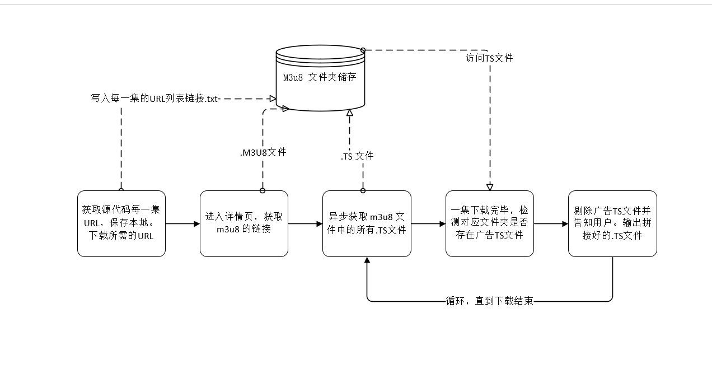

## 项目介绍

本项目用于：批量下载指定且已获得请求同意网站的 m3u8 视频，监测并移除视频中的广告 TS 文件

注意：项目 **无法直接运行** ，因为 config.py 已被加入 .gitignore。将缺失 URL 和 cookie

## 免责声明

本项目仅用于个人 Python 网络爬虫学习，请勿将本项目用于任何商业或非法用途，包括但不限于：
- 未经授权的数据采集、批量下载或爬取网站内容
- 对目标网站造成流量冲击、经济损失或服务器压力
- 侵犯任何第三方的知识产权、隐私权或服务条款

1. 请在利用本项目代码时遵守 Robots.txt 协议。
2. 请遵守所在国家和地区的相关法律法规。
3. 项目作者对使用者的任何行为概不负责。
4. 若您使用本项目造成任何法律纠纷或损失，责任由使用者自行承担。
5. 本项目中提到的任何网站、接口、资源仅作为学习演示之用，与项目作者无关。

